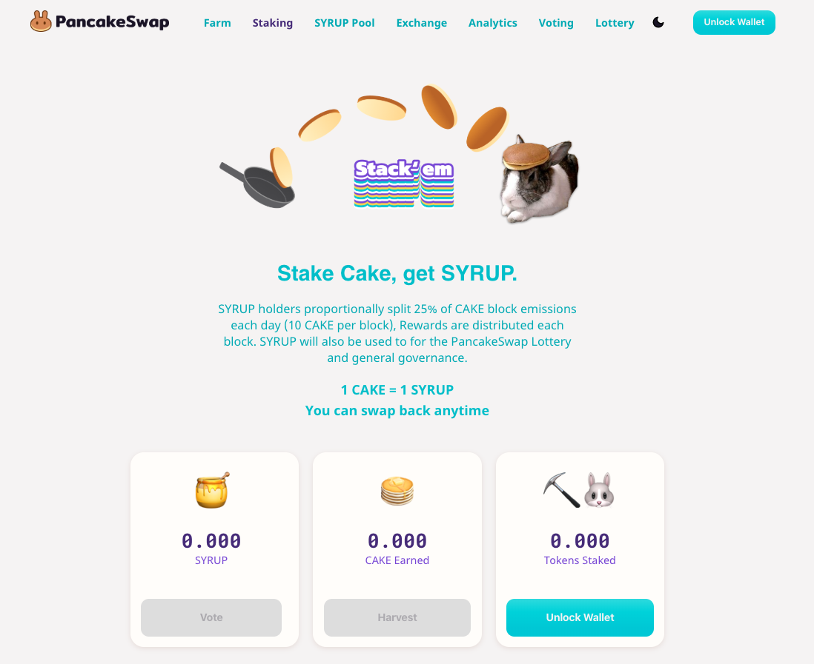

### Imagine:

1. You STAKE your CAKE to get SYRUP
2. Now you are earning a portion of 25% of each block reward
3. Now you stake that SYRUP and start earning tokens from brand new BSC projects

<!--truncate-->

##### This is galaxy mega brain CAKE compounding.

Your CAKE is now pulling in multiple income streams. Sounds… **“sweet”**, right? 😏

SYRUP Pool: where sweet, new tokens meet the PancakeSwap community!

Syrup Pool allows Binance Smart Chain projects to bootstrap adoption by distributing a portion of their tokens to SYRUP token holders.

Syrup Pool will be split into two sections: Core and Community. Core will be initially selected by the PancakeSwap team.

Community will be projects that pass a community vote on the governance portal.

Note that any project will be able to distribute tokens via Syrup Pool but only projects that win a vote would be listed on the swap interface as a default option (in order to discourage scams).

### Why would projects want to participate?

Since PancakeSwap has had the fairest launch ever, SYRUP Pool projects will allow projects to receive market attention by issuing tokens to the largest (and most active) BSC community.

Projects will also receive an immediate default listing on the PancakeSwap interface, obtaining priority promotion on the exchange (by ranking temporarily first in selecting tokens on the website).

### Extending the utility of SYRUP tokens

Governance, collecting fees, stacking CAKE block rewards and the (upcoming) Golden Syrup lottery are some of the SYRUP token’s core utility functions… for now.

With SYRUP Pool, a new function has been offered for SYRUP holders in PancakeSwap: adding the toppings to $SYRUP and the $CAKE.

### Where are the projects?

If you’ve read this far, you’ve probably found this concept somehow interesting. Don’t worry: the first projects (with an “s”) will be announced very soon, and the SYRUP Pool is already close to finishing development.

#### Stack’em!

_Chef Hops_
