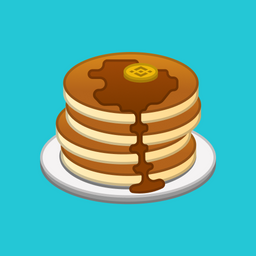

## 煎饼(CAKE)

**代币名称:** CAKE

**合约地址:** [https://bscscan.com/token/0x0e09fabb73bd3ade0a17ecc321fd13a19e81ce82](https://bscscan.com/token/0x0e09fabb73bd3ade0a17ecc321fd13a19e81ce82)

**链:** 币安智能链 \(代币规格: BEP-20\)

**发放比率:**

- **每区块生成 -** 40 CAKE \*\*\*\*
- **每日生成总生成 \(按照每天有约 30,000 个区块生成\) -** 1,200,000 CAKE per day

#### **分发:**

- **农夫(流动性提供者) -** 每个区块生成当中 75%的奖励 \(约每区块 30 枚 CAKE 奖励\)
  - **每日农夫(流动性提供者) -** 900,000 枚 CAKE \(按照每天 30,0000 个区块来估算\)
- **糖浆(SYRUP) 锁仓的用户 -** 每个区块生成当中 25%的奖励 \(约每区块 10 枚 CAKE 奖励\)
  - **每天糖浆(SYRUP) 锁仓的用户 -** 300,000 枚 CAKE \(按照每天 30,0000 个区块来估算\)

---

## 糖浆(SYRUP)

**代币名称:** SYRUP

**合约地址:** [https://bscscan.com/token/0x009cf7bc57584b7998236eff51b98a168dcea9b0](https://bscscan.com/token/0x009cf7bc57584b7998236eff51b98a168dcea9b0)

**链:** 币安智能链 \(代币规格: BEP-20\)

**发放比率:** 锁仓松饼(Cake)后、可 1:1 地兑换出 SYRUP..

- CAKE 新生成量的 25％将在每个区块中、分配给 SYRUP 持有者。用户可以选择将这些奖励重新进行投资或锁仓。
- CAKE 持仓用户将可以兑换 1:1 地兑换成 SYRUP
- CAKE 分发数量是每个区块生成时、用户在 SYRUP 池子里面的占比。（锁仓额度占比越大、领得越多。）
- 我们只会将 CAKE 的分发奖励、分发给一开始锁仓领取 SYRUP 时的钱包地址。（虽然糖浆可以发送到其他地址，但只有起始地址会收到 CAKE 奖励）

## 黄金糖浆 (Golden SYRUP) - (乐透功能)

> COMING SOON

---
